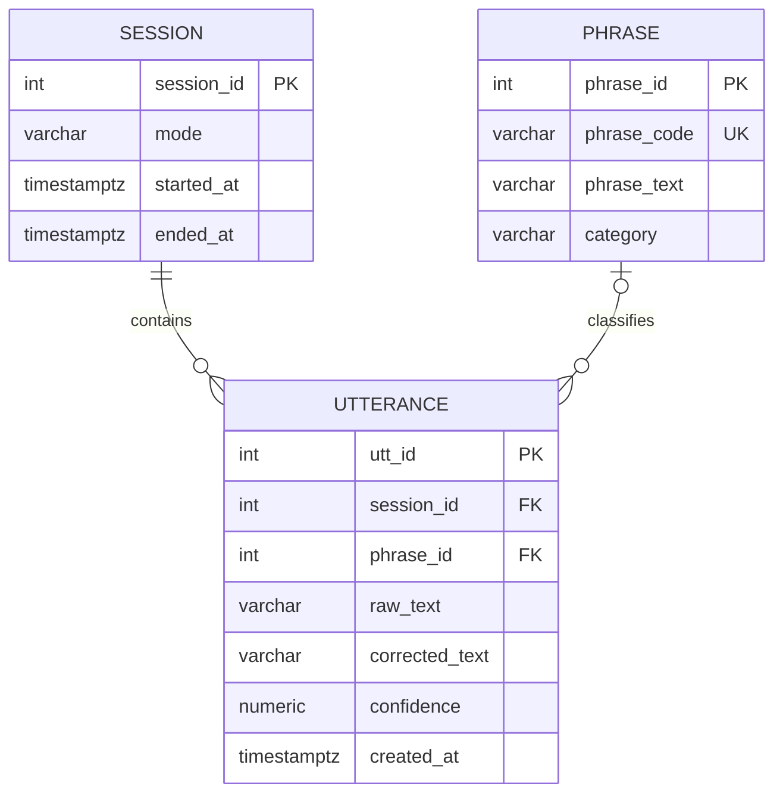

# 립리딩 백엔드 ERD 명세

## 1. 문서의 권위

이 문서는 데모 PostgreSQL schema의 Source of Truth다. 백엔드 범위와 운영 원칙은 [`backend-sot.md`](backend-sot.md), 외부 wire contract는 [`api-spec.md`](api-spec.md)를 따른다. SQLAlchemy metadata와 Alembic migration은 이 명세를 실행 가능한 형태로 구현한다.

## 2. ERD

## 3. enum 값

PostgreSQL native enum 대신 `VARCHAR + CHECK`를 사용한다.

- `session.mode`: `CLOSED`, `OPEN`
- `phrase.category`: `PAIN`, `REQUEST`, `REPLY`, `ETC`

값을 추가할 때는 이 문서, 애플리케이션 enum, CHECK constraint와 테스트를 같은 migration에서 변경한다.

## 4. 테이블 명세

### `session`

| 컬럼 | PostgreSQL 타입 | null | 기본값·제약 |
|---|---|---|---|
| `session_id` | `INTEGER` identity | 아니오 | PK |
| `mode` | `VARCHAR(16)` | 아니오 | `CLOSED` 또는 `OPEN` |
| `started_at` | `TIMESTAMPTZ` | 아니오 | `now()` |
| `ended_at` | `TIMESTAMPTZ` | 예 | 값이 있으면 `started_at` 이상 |

`ended_at IS NULL`은 연결이 시작됐지만 정상·비정상 종료 처리가 아직 완료되지 않았음을 의미한다. 프로세스 강제 종료로 cleanup이 실행되지 않으면 오래된 열린 세션이 남을 수 있으며, 최대 세션 시간과 종료 여유보다 이전인 명시적 기준 시각으로 reconciliation 관리 명령을 실행한다.

### `phrase`

| 컬럼 | PostgreSQL 타입 | null | 기본값·제약 |
|---|---|---|---|
| `phrase_id` | `INTEGER` identity | 아니오 | PK |
| `phrase_code` | `VARCHAR(64)` | 아니오 | UNIQUE, 모델 라벨 맵에서 사용하는 불변 식별자 |
| `phrase_text` | `VARCHAR(100)` | 아니오 | 공백 문자열 금지 |
| `category` | `VARCHAR(16)` | 아니오 | `PAIN`, `REQUEST`, `REPLY`, `ETC` |

문구 표시 텍스트가 바뀌어도 `phrase_code`는 변경하지 않는다. 모델의 class index를 환경별 DB PK에 직접 연결하지 않는다.

### `utterance`

| 컬럼 | PostgreSQL 타입 | null | 기본값·제약 |
|---|---|---|---|
| `utt_id` | `INTEGER` identity | 아니오 | PK |
| `session_id` | `INTEGER` | 아니오 | `session.session_id` FK, `ON DELETE CASCADE` |
| `phrase_id` | `INTEGER` | 예 | `phrase.phrase_id` FK, `ON DELETE SET NULL` |
| `raw_text` | `VARCHAR(200)` | 아니오 | 공백 문자열 금지 |
| `corrected_text` | `VARCHAR(200)` | 예 | 값이 있으면 공백 문자열 금지 |
| `confidence` | `NUMERIC(4,3)` | 예 | `0.000..1.000` |
| `created_at` | `TIMESTAMPTZ` | 아니오 | `now()` |

폐쇄형 결과는 `phrase_id`를 연결할 수 있고 개방형 결과는 `NULL`을 허용한다. 모델이 보낸 `phrase_code`가 seed에 아직 없어도 최종 텍스트는 저장하고 `phrase_id`만 `NULL`로 둔다. 이로써 label map 교체가 API 실패로 번지지 않게 한다. 외부 API에 표시할 문장은 `corrected_text`가 존재하면 해당 값을, 아니면 `raw_text`를 사용한다.

## 5. 인덱스와 삭제 정책

- `phrase.phrase_code`에 unique index를 둔다.
- `session.started_at`에 명시적 정리 조회용 index를 둔다.
- `utterance(session_id, created_at)`에 조회·정리용 index를 둔다.
- `utterance.phrase_id`에 문구 삭제의 FK 갱신용 index를 둔다.
- 세션 삭제는 연결된 발화를 함께 삭제한다.
- 문구 삭제는 과거 발화를 보존하고 `phrase_id`만 `NULL`로 만든다.
- 자동 보존기간은 적용하지 않는다.
- 관리 명령은 정확한 `session_id` 또는 명시적인 기준 시각을 요구하고, 실제 삭제에는 확인 옵션이 필요하다.
- 오래된 열린 세션 reconciliation은 timezone이 포함된 명시적 기준 시각과 확인 옵션을 요구하며, 발화를 삭제하지 않고 `ended_at`만 기록한다.
- 데모의 인식 데이터는 위 관리 명령으로 명시적으로 삭제한다. 실제 사용자 데이터를 저장하기 전에는 별도 보존기간과 정기 purge 운영 절차를 정해야 한다.

## 6. 데모 seed

schema migration과 데모 데이터 입력을 분리한다. idempotent seed 명령은 `phrase_code`를 기준으로 다음 문구를 upsert한다.

| phrase_code | phrase_text | category |
|---|---|---|
| `PAIN_GENERAL` | 아파요 | `PAIN` |
| `REQUEST_WATER` | 물 주세요 | `REQUEST` |
| `REQUEST_TOILET` | 화장실 | `REQUEST` |
| `STATE_COLD` | 추워요 | `ETC` |
| `STATE_HOT` | 더워요 | `ETC` |
| `REQUEST_LIGHTS_OFF` | 불 꺼 주세요 | `REQUEST` |

문구셋이 확정되면 seed 데이터와 모델 bundle의 label map을 함께 갱신한다.

## 7. 의도적으로 저장하지 않는 데이터

- 사용자·OAuth 정보
- 원본 영상, JPEG bytes, 디코딩 프레임과 오디오
- IP, User-Agent와 브라우저 fingerprint
- 로컬 파일·asset·체크포인트 경로
- 스트리밍 중간 결과
